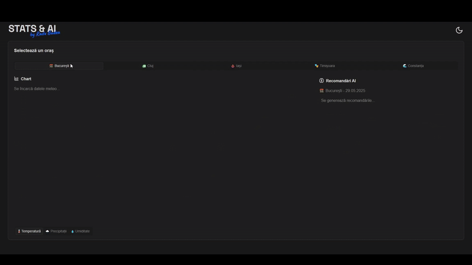
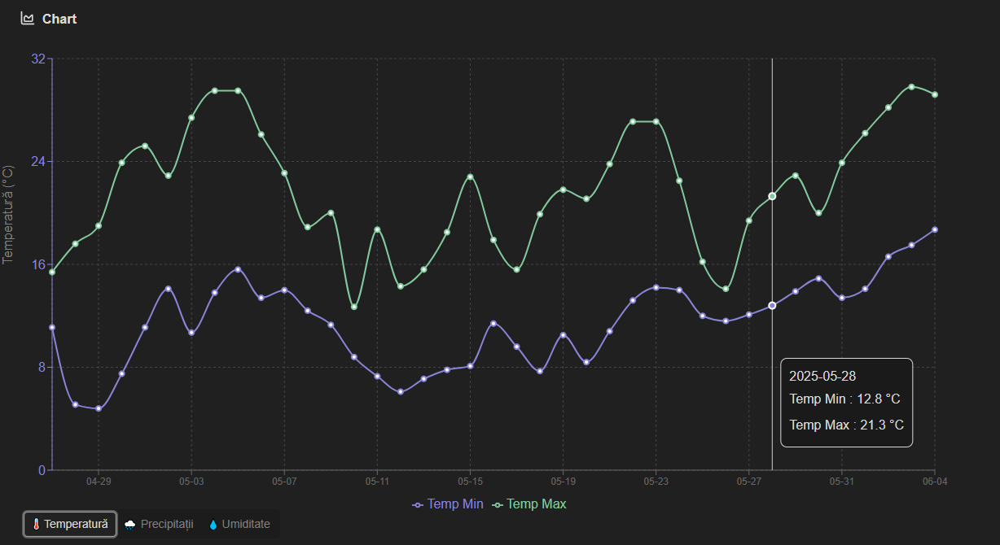
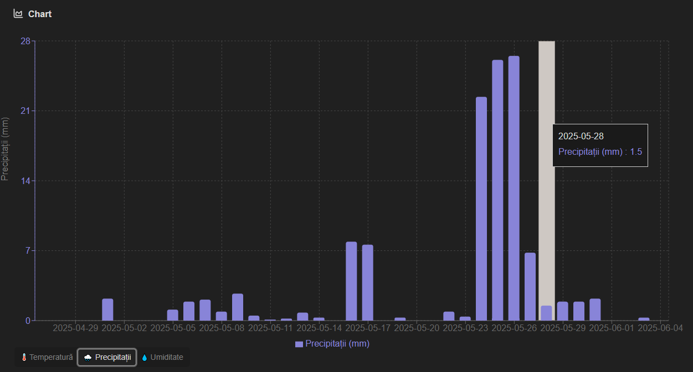

# 🌦️ Stats&AI – Vremea care gândește

**Stats&AI** este mai mult decât o simplă aplicație meteo. Este o combinație inteligentă între date, design și algoritmi AI — o platformă modernă care îți oferă nu doar prognoza pe orașele din România, ci și recomandări personalizate generate cu ajutorul inteligenței artificiale.

## 🧠 Ce face special acest proiect?

Cu ajutorul modelului **Gemma 3** de la Google, găzduit local prin Ollama, aplicația generează zilnic **recomandări scrise natural în limba română**: ce haine să porți, dacă e momentul potrivit pentru o plimbare în parc sau dacă ar trebui să iei umbrela cu tine. Totul bazat pe date reale despre temperatură, precipitații și umiditate.



## 🔧 Tehnologii folosite

### 🐍 Backend – Python API modern și minimalist

- Framework simplu și rapid
- Colectează date de la [Open-Meteo API](https://open-meteo.com/)
- Salvează datele local în fișiere `.csv`
- Expune endpointuri RESTful pentru frontend
- Integrare cu AI local (Gemma 3 via Ollama)

### 🧠 AI – Google Gemma 3 (via Ollama)

- Rularea modelului pe localhost (fără costuri cloud)
- Prompturi dinamice generate pe baza prognozei zilnice
- Recomandări scrise coerent, natural și prietenos

### ⚛️ Frontend – React + TypeScript

- Arhitectură component-based, rapidă și scalabilă
- Datele sunt afișate în mod interactiv și intuitiv

### 🎨 UI/UX – ShadCN + Tailwind CSS

- Design curat și modern, complet responsiv
- Animații subtile, palete de culori dark/light
- Navigare rapidă între orașe prin taburi elegante
- Vizualizări grafice interactive pentru temperatură și precipitații

## 🏙️ Ce orașe sunt incluse?

Aplicația oferă date meteo și sfaturi AI pentru 5 mari orașe din România:

- 🌆 București
- 🚞 Cluj
- 🏫 Iași
- 🎭 Timișoara
- 🌊 Constanța

## 📊 Ce date sunt afișate?

- Temperaturi minime și maxime pe 2 săptămâni
- Prognoză pentru următoarele 7 zile
- Precipitații zilnice
- Umiditate minimă și maximă
- Recomandări AI (pentru ziua de azi)




## 🚀 De ce e cool acest proiect?

- 🔗 Combină AI local + date reale = 100% control și flexibilitate
- 🧪 Demonstrează cum poți folosi modelele LLM pentru scopuri practice
- 💅 Arată ce înseamnă un UI modern cu ShadCN și Tailwind
- 🛠️ Ideal ca proiect de portofoliu pentru full-stack developers
- 🇷🇴 Complet localizat în limba română

## 📦 Instalare rapidă (dev - pentru testare/prezentare)

```bash
# Backend - primul terminal
cd backend
python -m venv venv
source venv/bin/activate  # sau .\venv\Scripts\activate pe Windows
pip install -r requirements.txt
uvicorn main:app --reload --port 8000

# Frontend -- al doilea terminal
cd frontend
npm install
npm run dev
```
